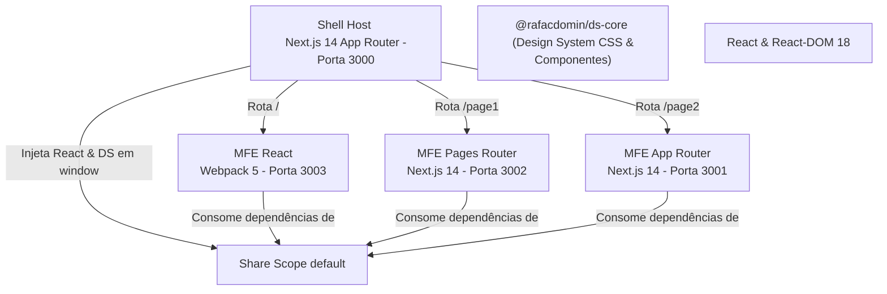

# Plataforma de Microfrontends (Module Federation 2.0 + Design System)

Este repositório contém uma plataforma integrada através de uma arquitetura de **Microfrontends (MFEs)** federados usando **Module Federation 2.0** e consumindo um **Design System corporativo centralizado (`@rafacdomin/ds-core`)**.

---

## ⚡ Resumo Executivo (TL;DR)

### O que foi implementado:
* **Host (Shell)**: Next.js 14 App Router que atua como orquestrador do layout principal, sidebar, rodapé, controle de carregamento dinâmico e tratamento de erros com *Error Boundaries*.
* **Três Remotes independentes**:
  * `/` (Home): **MFE React** (React 18 puro com Webpack 5 manual).
  * `/page1`: **MFE Pages Router** (Next.js 14 Pages Router).
  * `/page2`: **MFE App Router** (Next.js 14 Pages Router estrutural).
* **Consumo do Design System**: Todos os MFEs utilizam o pacote `@rafacdomin/ds-core` (como os componentes `Card` e `Tag`) de forma integrada e reagem dinamicamente aos tokens globais de estilo.

## 📐 Arquitetura do Sistema

O diagrama abaixo ilustra como o Shell orquestra a injeção de dependências compartilhadas e consome os módulos remotos:



---

## 📂 Estrutura do Repositório

A estrutura monorepo do projeto está organizada da seguinte forma:

```
micro-frontend/
├── mfe-shell/             # Host Orquestrador (Next.js 14 App Router) - Porta 3000
├── mfe-app-router/        # Remote exposto em /page2 (Next.js 14) - Porta 3001
├── mfe-pages-router/      # Remote exposto em /page1 (Next.js 14) - Porta 3002
├── mfe-react/             # Remote exposto na Home / (React 18 + Webpack 5) - Porta 3003
├── references/            # Guias, referências e documentações de apoio
└── SPEC.md                # Especificação técnica do ecossistema
```

---

## 🎨 Integração com o Design System (`ds-core`)

A plataforma foi construída sob rígidos critérios de consistência visual utilizando o pacote npm `@rafacdomin/ds-core`:

1. **Tokens CSS Nativos**:
   * As cores, bordas, fontes e elevações utilizam as variáveis CSS nativas expostas pelo Design System (ex: `var(--color-primary)`, `var(--color-bg-base)`, `var(--radius-lg)`).
2. **Componentes Unificados**:
   * O layout dos remotes utiliza os blocos visuais `<Card>` e `<Tag>` importados diretamente da biblioteca centralizada.
3. **Herdabilidade de Fontes**:
   * O Host importa e define as variáveis de fonte Geist. As classes do layout global propagam a tipografia através de `font-family: var(--font-geist-sans), sans-serif`, assegurando consistência em todas as renderizações de remotes.
4. **Fallback e Tratamento de Erros**:
   * Em caso de indisponibilidade de rede de algum remote, o Shell exibe um fallback de erro amigável, estilizado com o componente `<Card variant="bordered">` e alinhado aos tokens de alerta do design system.

---

## 🚀 Como Executar Localmente

### 1. Pré-requisitos
Certifique-se de ter o **Node.js** (versão 18 ou superior) instalado em sua máquina.

### 2. Instalar as Dependências
Como o repositório é composto por aplicações isoladas, cada pasta possui suas dependências. Para instalar todas, execute nas respectivas pastas:
```bash
# Na raiz, você pode instalar individualmente
cd mfe-shell && npm install
cd ../mfe-app-router && npm install
cd ../mfe-pages-router && npm install
cd ../mfe-react && npm install
```

### 3. Rodar as Aplicações em Modo de Desenvolvimento
Inicie os servidores de desenvolvimento de cada aplicação simultaneamente (em abas separadas do terminal):

```bash
# No diretório de cada aplicação:
npm run dev
```

| Aplicação | Comando | Porta | Rota no Shell |
| :--- | :--- | :--- | :--- |
| **mfe-shell** | `npm run dev` | `3000` | Host (Casca) |
| **mfe-app-router** | `npm run dev` | `3001` | `/page2` |
| **mfe-pages-router** | `npm run dev` | `3002` | `/page1` |
| **mfe-react** | `npm run dev` | `3003` | `/` (Home) |

Acesse `http://localhost:3000` no seu navegador para visualizar o ecossistema integrado.

### 4. Executar os Testes Unitários
Os testes unitários e de integração foram configurados utilizando **Vitest** e **React Testing Library**. Para executá-los em qualquer aplicação:
```bash
npm run test
```
